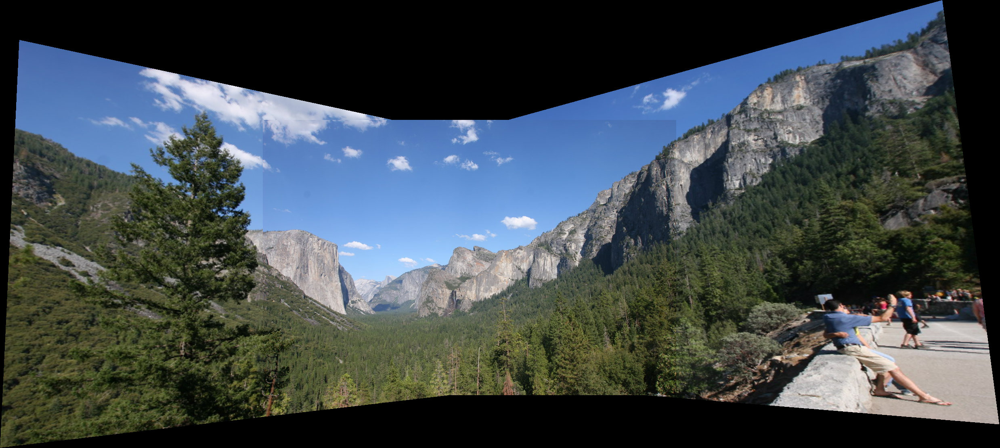

# Panorama Stitching

## 对比结果：

### 不同的特征描述方式得到的匹配点对数（最优距离<0.8*次优结果）：

| descriptor | 图1 | 图2 | 图3 | 图4 |
|-----|-----|-----|-----|-----|
| 像素值排列 | 33 | 94 | 64 | 48 |
| SIFT | 72 | 171 | 84 | 73 |

### 在上面的基础上使用RANSAC算法得到的正确的匹配点对数：

| descriptor | 图1  | 图2  | 图3  | 图4  |
| ---------- | ---- | ---- | ---- | ---- |
| 像素值排列 | 8    | 33   | 15   | 14   |
| SIFT       | 55   | 161  | 73   | 44   |

可以看出SIFT特征描述得到的对应点准确率更高。并且在使用像素值作为特征描述时，并不能正确的反映图像旋转等变换，最终得到的Homography往往是错误的，拼接的图像往往也是扭曲。

## 拼接图像结果：

### SIFT:

## 

### 像素值：

## 讨论：

**问题1：**图像拼接时，不同的图像可能是亮度或者曝光不一致导致图像拼接处有明显的拼接痕迹，尝试用两张图像平均一下来解决这个问题，虽然消除了拼接痕迹，但是会造成一定的重影。目前没想到很好的解决办法，可能要用一些深度学习的方法？

**问题2：**多张图像拼接的时候如何选择用哪张图像的视角作为主视角呢？例如像第二个数据集中，如果选择的主视角图像是最左边的图像，拼接出的结果右面的图像可能被拉扯的很厉害。因为给定的数据集照片都是按照一定顺序排列好的视角，所以直接用数据集中的第二张作为主视角了，可以尽量保证主视角是在中间部分，如果数据集没有这样排列好那要怎么解决这个问题呢？
